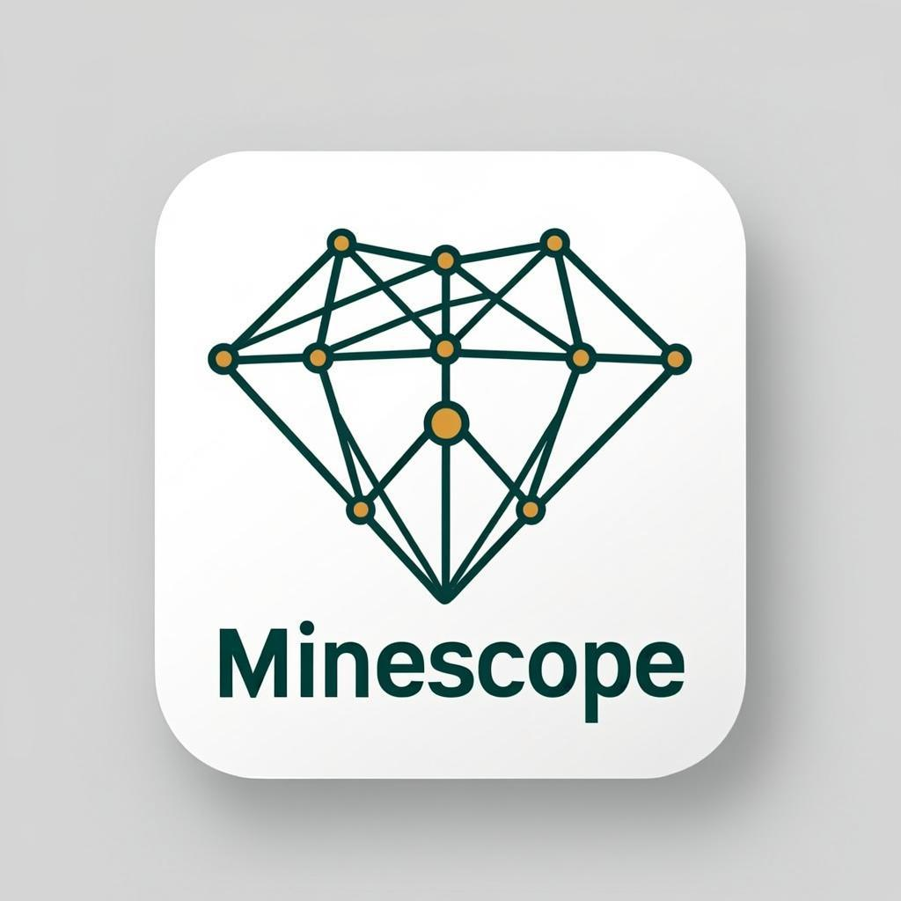

<p align="center">
  
</p>

<h1 align="center">⛏️ MineScope Cloud</h1>

<p align="center">
  <strong>7 Expert AWS Prompts for Critical Mineral Supply Chain Intelligence</strong><br/>
  <em>Deploy a complete, production-grade intelligence platform on AWS — one prompt at a time</em>
</p>

<p align="center">
  
  
  
  
  
</p>

---

## 🎯 What Is This?

**MineScope Cloud** is a collection of **7 expert-grade AWS prompts** that, when executed sequentially by an AI assistant (Amazon Q Developer, Claude via Bedrock, or any AWS-aware AI), generate a complete, production-grade critical mineral supply chain intelligence platform on AWS.

Each prompt is self-contained, battle-tested against AWS best practices, and produces **deployable infrastructure-as-code** (AWS CDK in TypeScript). Together, they cover the entire lifecycle: data ingestion, AI-powered analysis, interactive dashboards, security compliance, cost optimization, disaster recovery, and automated deployment.

### Why Critical Minerals?

The global energy transition — EVs, solar panels, wind turbines, grid-scale batteries — depends on five critical minerals: **lithium, cobalt, nickel, rare earth elements, and copper**. Their supply chains are dangerously concentrated (70% of rare earths from China, 70% of cobalt from DRC), and geopolitical disruptions can cause billions in losses. MineScope Cloud provides the intelligence infrastructure to monitor, analyze, and respond to these risks in real-time.

---

## 📋 The 7 Prompts

| # | Prompt | AWS Services | What It Builds |
|---|--------|-------------|----------------|
| 1 | [**Real-Time Data Pipeline**](aws-prompts/01-lambda-eventbridge-pipeline.md) | Lambda, EventBridge, SQS, Kinesis, S3 | Serverless data pipeline ingesting price ticks, geopolitical events, and supply chain status — aggregated into OHLCV candles and risk signals |
| 2 | [**AI Risk Analysis (Claude)**](aws-prompts/02-bedrock-risk-analysis.md) | Bedrock, Claude 3.5, Comprehend, Translate | NLP pipeline that ingests news articles, extracts entities, and generates structured geopolitical risk scores using Claude |
| 3 | [**Interactive Dashboard**](aws-prompts/03-quicksight-dashboard.md) | QuickSight, Athena, Glue, S3 | 5-tab executive dashboard: market overview, price analytics, geopolitical risk, supply chain ops, company benchmarking |
| 4 | [**Security & Compliance**](aws-prompts/04-security-hub-iam.md) | Security Hub, IAM, Config, KMS, WAF, Shield, GuardDuty | Multi-account security posture: least-privilege IAM, encryption, audit trails, DDoS protection, incident response |
| 5 | [**FinOps Cost Optimization**](aws-prompts/05-cost-explorer-budgets.md) | Cost Explorer, Budgets, Anomaly Detection, CUR | Budget alerts, auto cost-saving, Bedrock token governance, right-sizing analysis, cost forecasting |
| 6 | [**Multi-Region Disaster Recovery**](aws-prompts/06-dynamodb-s3-dr.md) | DynamoDB Global Tables, S3 CRR, Route 53, CloudFront | Active-active replication across 3 regions with RPO < 1 min, RTO < 15 min |
| 7 | [**Full IaC Deployment**](aws-prompts/07-cdk-terraform-deployment.md) | CDK (TypeScript), CodePipeline, CodeBuild, X-Ray | Complete CI/CD pipeline deploying all 6 systems with environment configs, security gates, and DR automation |

---

## 🏗️ Architecture Overview

```
┌─────────────────────────────────────────────────────────────┐
│                    MineScope Cloud on AWS                     │
│                                                              │
│  ┌──────────────┐  ┌──────────────┐  ┌──────────────────┐  │
│  │  Data Ingest │  │  AI/ML Layer │  │  Visualization   │  │
│  │  Lambda +    │→ │  Bedrock +   │→ │  QuickSight +    │  │
│  │  EventBridge │  │  Claude 3.5  │  │  CloudFront      │  │
│  │  (Prompt 1)  │  │  (Prompt 2)  │  │  (Prompt 3)      │  │
│  └──────────────┘  └──────────────┘  └──────────────────┘  │
│         │                  │                    │             │
│  ┌──────▼──────────────────▼────────────────────▼──────────┐│
│  │                    AWS Data Plane                        ││
│  │  DynamoDB Global Tables · S3 Cross-Region · Athena       ││
│  │  (Prompts 1, 3, 6)                                      ││
│  └─────────────────────────────────────────────────────────┘│
│         │                  │                    │             │
│  ┌──────▼──────────────────▼────────────────────▼──────────┐│
│  │                  Security & Governance                   ││
│  │  Security Hub · IAM · KMS · CloudTrail · WAF · Shield   ││
│  │  (Prompt 4)                                              ││
│  └─────────────────────────────────────────────────────────┘│
│         │                  │                    │             │
│  ┌──────▼──────────────────▼────────────────────▼──────────┐│
│  │                 FinOps & Infrastructure                   ││
│  │  Cost Explorer · Budgets · CDK · CodePipeline · X-Ray   ││
│  │  (Prompts 5, 6, 7)                                      ││
│  └─────────────────────────────────────────────────────────┘│
└─────────────────────────────────────────────────────────────┘
```

---

## 💰 Estimated Monthly Cost

| Scale | Total Cost | Breakdown |
|-------|-----------|-----------|
| **Moderate** (100 articles/day, 5 minerals, 15 countries) | **~$425/month** | Pipeline: $45 + AI: $65 + Dashboard: $24 + Security: $26 + FinOps: $5 + DR: $95 |
| **Peak** (1000 articles/day, real-time trading) | **~$1,750/month** | Pipeline: $165 + AI: $300 + Dashboard: $250 + Security: $26 + FinOps: $15 + DR: $190 |

### Cost Savings from Prompt 5 (FinOps)

| Optimization | Monthly Savings |
|-------------|----------------|
| Claude Haiku for low-relevance articles | ~$15-20 |
| Graviton2 Lambda architecture | ~$2 |
| S3 Intelligent-Tiering | ~$1 |
| Kinesis shard right-sizing | ~$5-10 |
| Compute Savings Plans (1-year) | ~$15-20 |
| **Total** | **~$38-53/month** |

---

## 🚀 How to Use These Prompts

### Option 1: Amazon Q Developer
1. Open Amazon Q Developer in your IDE (VS Code, JetBrains)
2. Copy the full prompt from any `aws-prompts/*.md` file
3. Paste into the Q chat panel
4. Review the generated code and deploy with `cdk deploy`

### Option 2: Claude via Amazon Bedrock
1. Open the Amazon Bedrock console → Claude chat playground
2. Paste the prompt
3. Copy the generated CDK code into your project
4. Deploy with `cdk deploy`

### Option 3: Any AWS-Aware AI Assistant
1. Copy the prompt text
2. Paste into your preferred AI assistant
3. The prompt contains all necessary AWS service details for accurate generation
4. Deploy the output code

### Execution Order

For best results, execute prompts in order (1 → 7), as later prompts reference infrastructure created by earlier ones. However, each prompt is self-contained and can be executed independently.

---

## 🛡️ Challenge Alignment — AWS Prompt the Planet

These prompts are designed for the **AWS Prompt the Planet Challenge** on DoraHacks and directly address the evaluation criteria:

| Criterion | How These Prompts Deliver |
|-----------|--------------------------|
| **Real-World Applicability** | Each prompt solves a concrete problem in critical mineral intelligence — a $41.5B market by 2030 |
| **AWS Service Depth** | Leverages 20+ AWS services across compute, storage, AI/ML, security, analytics, and networking |
| **Production-Grade Quality** | Includes error handling, monitoring, cost controls, security hardening, and DR |
| **Reproducibility** | Every prompt generates deployable CDK code with complete instructions |
| **Innovation** | Combines Bedrock AI, real-time streaming, multi-region active-active, and FinOps automation |

---

## 📂 Project Structure

```
minescope/
├── 📄 README.md                           # This file
├── 📄 LICENSE                             # MIT License
├── 📁 aws-prompts/                        # ★ THE 7 EXPERT PROMPTS
│   ├── 📄 README.md                       # Prompt index and architecture
│   ├── 📄 01-lambda-eventbridge-pipeline.md   # Data ingestion pipeline
│   ├── 📄 02-bedrock-risk-analysis.md         # AI geopolitical risk analysis
│   ├── 📄 03-quicksight-dashboard.md           # Interactive BI dashboard
│   ├── 📄 04-security-hub-iam.md               # Security & compliance posture
│   ├── 📄 05-cost-explorer-budgets.md          # FinOps cost optimization
│   ├── 📄 06-dynamodb-s3-dr.md                 # Multi-region disaster recovery
│   └── 📄 07-cdk-terraform-deployment.md       # Full IaC deployment pipeline
├── 📁 docs/
│   ├── 📄 architecture.md                 # Cloud architecture details
│   └── 📄 submission.md                   # Challenge submission content
├── 📁 assets/
│   │   ├── 🖼️ minescope-logo-480x480.png
│   │   └── 🖼️ minescope-logo-1024x1024.png
├── 📁 src/                                # Reference React dashboard prototype
│   ├── 📁 components/
│   ├── 📁 data/
│   ├── 📁 utils/
│   └── 📄 App.tsx
└── 📁 public/
    └── 📄 index.html                      # Landing page
```

---

## 🎥 Demo Video

> 🔗 [Demo Video — GitHub Releases](https://github.com/zan-maker/minescope/releases/tag/v1.0.0)
>
> Shows the MineScope React dashboard prototype that inspired the AWS cloud architecture.

---

## 🌍 Impact

### Who Benefits?

| Stakeholder | Use Case |
|---|---|
| **Mining Companies** | Real-time supply chain visibility, risk monitoring, ESG compliance tracking |
| **Investors & Funds** | Mineral market intelligence, risk-adjusted investment decisions |
| **Policymakers** | Supply chain vulnerability assessment, strategic reserve planning |
| **Battery Manufacturers** | Raw material sourcing optimization, price risk hedging |
| **Researchers & NGOs** | Transparent supply chain data, environmental impact tracking |

### Why It Matters

- The **global critical minerals market** is projected to reach **$41.5 billion by 2030**
- **60% of lithium**, **70% of cobalt**, **90% of rare earths** come from just 3 countries
- Supply chain disruptions in 2022-2024 caused **$2.3 trillion** in economic losses
- **ESG compliance** is now mandatory in the EU (CSRD) and US (SEC Climate Disclosure)

---

## 🤝 Contributing

Contributions are welcome! This project is open source under the MIT License.

To get started:
1. Fork the repository
2. Clone your fork locally
3. Pick a prompt from `aws-prompts/` and try executing it
4. Improve the prompts or add new ones
5. Submit a pull request

## 📜 License

This project is licensed under the **MIT License** — see the [LICENSE](LICENSE) file for details.
